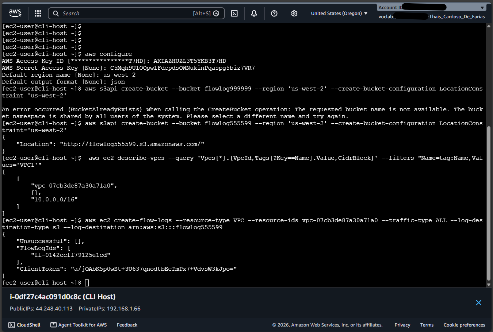
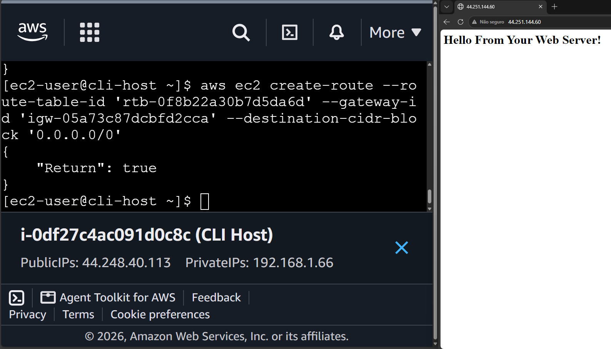
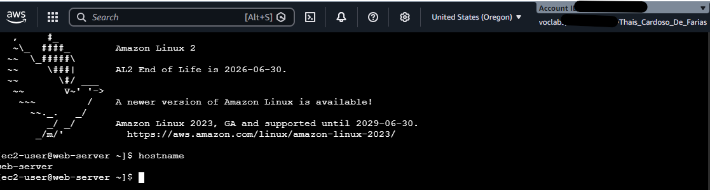
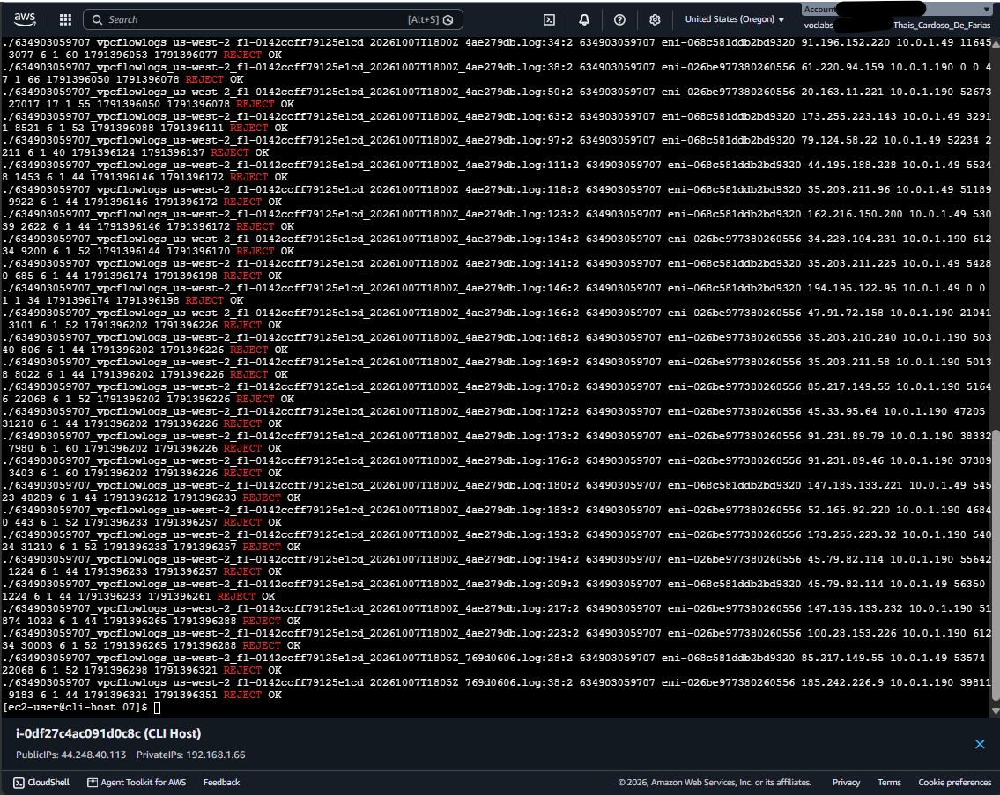

# 🛠️ AWS Network Troubleshooting & Forensic Log Analysis


## 📌 Sobre o Projeto

Este projeto consiste na simulação, diagnóstico e resolução prática de falhas de conectividade de rede em uma infraestrutura **Amazon VPC**, além do rastreio e análise forense de tráfego com o **VPC Flow Logs** e **AWS CLI**.

O objetivo principal foi agir como um **Engenheiro de Cloud/DevOps** diante de um cenário de indisponibilidade de serviços (Servidor Web fora do ar e SSH bloqueado) e restaurar o acesso aplicando boas práticas de arquitetura e segurança em camadas na AWS.

---

## 🎯 Aprendizados e Competências Adquiridas

Ao concluir este laboratório, demonstrei e consolidei as seguintes habilidades práticas:

- **Troubleshooting de Redes em Nuvem:** Diagnóstico estruturado de falhas em subredes públicas, tabelas de roteamento e regras de firewall.
- **Segurança em Camadas (Defense in Depth):** Entendimento prático das diferenças operacionais entre **Security Groups** (Stateful / nível de instância) e **Network ACLs** (Stateless / nível de subrede).
- **Observabilidade de Rede:** Configuração do **VPC Flow Logs** integrado ao **Amazon S3** para captura de tráfego de rede sem a necessidade de agentes.
- **Análise Forense via Terminal Linux:** Extração de arquivos compactados (`.gz`) e filtragem avançada de logs brutos com `grep` e `bash` para identificação de tráfego negado (`REJECT`).
- **Automação via AWS CLI:** Resolução de 100% dos incidentes utilizando comandos via linha de comando no terminal.

---

## 🖼️ Evidências Práticas e Passo a Passo da Solução

### 1. Habilitação do VPC Flow Logs e Armazenamento no S3
**Desafio:** Garantir a visibilidade do tráfego de rede para auditoria de segurança.  
**Solução:** Criação de um bucket S3 dedicado (`flowlog######`) e ativação do VPC Flow Logs com o filtro de captura `ALL` via AWS CLI.



* **O que a imagem comprova:** Saída do comando `aws ec2 create-flow-logs` no terminal com o status `FlowLogIds` gerado com sucesso, confirmando que os eventos de rede passaram a ser gravados no Amazon S3.

---

### 2. Diagnóstico e Resolução do Acesso Web (Route Table)
**Desafio:** O servidor web (*Cafe Web Server*) estava inacessível publicamente via navegador.  
**Causa Raiz:** A Tabela de Roteamento (*Route Table*) da subrede pública não continha uma rota padrão de saída para o **Internet Gateway (IGW)**.  
**Solução:** Criação da rota `0.0.0.0/0` associada ao IGW da VPC.



* **O que a imagem comprova:** Execução bem-sucedida do comando `aws ec2 create-route` retornando `"Return": true` e a confirmação do carregamento da aplicação no navegador exibindo *"Hello From Your Web Server!"*.

---

### 3. Diagnóstico e Resolução do Acesso SSH (Network ACL)
**Desafio:** As conexões administrativas via SSH (porta 22) falhavam continuamente, embora o *Security Group* estivesse com a porta liberada.  
**Causa Raiz:** Existência de uma regra de negação explícita (`DENY`) na **Network ACL (NACL)** associada à subrede pública.  
**Solução:** Identificação e remoção da regra de bloqueio nº 40 da NACL via AWS CLI.



* **O que a imagem comprova:** Conexão SSH estabelecida com sucesso via EC2 Instance Connect e execução do comando `hostname` confirmando o acesso direto à instância `web-server`.

---

### 4. Análise Forense dos VPC Flow Logs no Terminal
**Desafio:** Investigar os registros brutos de rede para auditoria das tentativas de conexão bloqueadas.  
**Solução:** Download dos arquivos de log armazenados no S3, descompactação dos arquivos `.gz` com `gunzip` e busca filtrada por tráfego rejeitado na porta 22 (`REJECT`).



* **O que a imagem comprova:** Saída detalhada no terminal Linux mostrando as entradas do log com a ação `REJECT`, mapeando interfaces de rede (`eni-*`), IPs de origem/destino e Unix Timestamps do momento do incidente.

---

## 📂 Estrutura do Repositório

```text
aws-vpc-network-troubleshooting/
│
├── README.md                           # Documentação do projeto/portfólio
└── images/                             # Evidências do projeto
    ├── 01-create-vpc-flow-log.png
    ├── 02-fix-route-table-web-access.png
    ├── 03-fix-nacl-ssh-access.png
    └── 04-analyze-vpc-flow-logs.png
```

## 🛠️ Tecnologias Utilizadas
* **AWS Services:** VPC, EC2, S3, Internet Gateway, Route Tables, Network ACLs, Security Groups, VPC Flow Logs.

* **Ferramentas de Gerenciamento:** AWS CLI, EC2 Instance Connect.

* **Sistemas Operacionais & CLI:** Amazon Linux 2, Bash, grep, gunzip.
